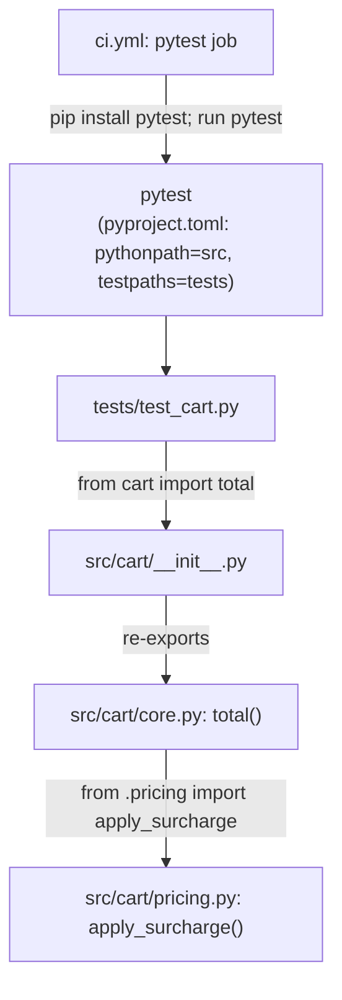

Only two runtime modules exist (`core.py`, `pricing.py`); there is no web
server, database, or external service in this repo — it is a single flat
package exercised entirely through `pytest`. The CI workflow
(`.github/workflows/ci.yml`) is deliberately minimal: checkout, set up
Python 3.12, `pip install pytest`, `pytest` — no linting, coverage, or
report-annotation steps, matching the "deliberately stock" claim in
../../README.md.
